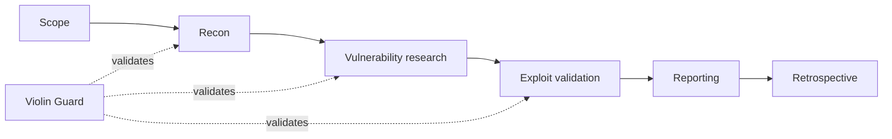

<p align="center">
  
</p>

<h1 align="center">Violin ☤ — Supervised Agentic Hermes Pentest Profile</h1>

<p align="center">
  <a href="https://github.com/Strategic-Automation/violin"></a>
  <a href="https://github.com/Strategic-Automation/violin/blob/master/LICENSE"></a>
  <a href="https://hermes-agent.nousresearch.com/">= 0.18.0"></a>
  <a href="https://www.kali.org/"></a>
  <a href="https://www.parrotsec.org/"></a>
</p>

<p align="center">
  <b>35 playbooks · 17 references · 13 templates · required execution guard · Hermes-native</b>
</p>

Violin is a **Hermes-native agentic pentest profile** for supervised, authorised penetration tests — from reconnaissance through safe exploit validation to reporting. It uses Hermes' built-in toolsets, seven routed skills, and the required `violin-guard` plugin at the target-execution boundary. The standalone CLI supports release checks, diagnostics, and administrative recovery; target commands run through the plugin. Violin adds no profile-specific credentials and inherits the provider and tool backends already configured in Hermes.

<p align="center">
  <a href="#quick-start">Quick start</a> ·
  <a href="#engagement-lifecycle">Workflow</a> ·
  <a href="#guard-tools">Guard tools</a> ·
  <a href="#benchmarks">Benchmarks</a> ·
  <a href="#development">Development</a>
</p>

---

<table>
<tr><td width="240"><strong>Guarded target execution</strong></td><td>Scope, phase, PTT, skill, hypothesis, history, and synchronization checks run before a target command starts.</td></tr>
<tr><td><strong>Persistent engagement state</strong></td><td>PTT tasks, hypotheses, command history, checkpoints, evidence, and reports survive context compression.</td></tr>
<tr><td><strong>Evidence-backed findings</strong></td><td>Validated findings require reproducible proof and canonical <code>FIND-NNN.md</code> artifacts.</td></tr>
<tr><td><strong>Routed methodology</strong></td><td>A pentest orchestrator selects focused web, identity, API, business-logic, LLM-security, and misconfiguration playbooks.</td></tr>
<tr><td><strong>Bounded execution</strong></td><td>Single commands, command bursts, background processes, batch review, heartbeat checks, and cancellation share one state model.</td></tr>
<tr><td><strong>Verifiable releases</strong></td><td>Plugin registration, schemas, skill snapshots, documentation contracts, lint, formatting, and the full test suite are release-gated.</td></tr>
</table>

## Quick start

### Install the profile

```bash
hermes profile install https://github.com/Strategic-Automation/violin
hermes -p violin
```

Then start with an authorized target and let Violin collect the scope before
any target interaction:

```text
Run an authorized penetration test against example.com.
```

### Requirements

- [Hermes Agent](https://hermes-agent.nousresearch.com/) 0.18.0 or newer
- Python 3.11 and `uv` for local development
- Kali Linux or Parrot OS for the expected security-tool environment
- Written authorization and an approved scope

Violin does not select a model or provider. Configure those in Hermes. For a
capable default, use **Qwen3.8 27B** locally or **DeepSeek V4 Flash** through a
hosted provider.

## Engagement lifecycle



1. Initialize the engagement and approve `scope/scope.yaml`.
2. Select one active PTT task and its routed skill with
   `violin_record_ptt`.
3. Run target commands with `violin_exec` or `violin_exec_burst`.
4. Update hypotheses as evidence changes their status.
5. Review each bounded command batch with `violin_review_batch`.
6. Generate canonical findings and the final report.
7. Complete the retrospective.

The complete phase model is:

```text
SCOPING → RECON → VULN_RESEARCH → EXPLOITATION
         → POST_EXPLOITATION / PRIVESC / FLAGS
         → REPORTING → RETROSPECTIVE
```

Starting work in a new phase requires a PTT task under that phase. Existing
tasks are not moved between phase sections.

## Guard tools

The plugin registers eleven Hermes tools from one typed registry:

| Tool | Purpose |
|---|---|
| `violin_record_ptt` | Create, start, refresh, close, or cancel a PTT task |
| `violin_record_hypothesis` | Create or update a scoped hypothesis |
| `violin_exec` | Execute one guarded command |
| `violin_exec_burst` | Execute a bounded command file |
| `violin_exec_status` | Read background execution status |
| `violin_exec_cancel` | Cancel tracked background execution |
| `violin_review_batch` | Review a completed batch and settle state |
| `violin_rebind_pending_batch` | Rebind a pending batch after confirmation |
| `violin_heartbeat_done` | Clear a completed heartbeat review |
| `violin_target` | Resolve the approved assessment target |
| `violin_status` | Explain current tasks, skills, and blockers |

`violin_exec` is the generic target-command boundary. There are no
tool-specific execution adapters or binary allowlists. Installed
non-interactive tools may run only after the engagement gates pass.

The raw-terminal hook is a best-effort safety net, not network containment.
Use `terminal` only for host-local preparation and administration.

## Safety model


- No target interaction before scope approval and bootstrap validation.
- No raw shell execution for target commands.
- No destructive, disruptive, credential, persistence, stealth, or
  third-party action without explicit written authorization.
- Raw evidence stays under `$ENG_DIR/evidence/<phase>/`.
- Secrets, dumps, and proof output stay out of `$ENG_DIR/state/`.
- Context compression resumes from engagement files in the current Hermes
  conversation.

The detailed policy is
[`skills/pentest/references/standards.md`](skills/pentest/references/standards.md).

## Engagement state

`init-engagement` creates the canonical working structure:

```text
$ENG_DIR/
├── scope/
│   └── scope.yaml
├── state/
│   ├── ptt.md
│   ├── history.md
│   └── checkpoint.json
├── hypotheses.md
├── evidence/
├── reporting/
└── retrospective/
```

### Skill delivery

Skills are loaded on demand. The first `violin_record_ptt` call for a routed
skill may return `skill_prepared` without changing the PTT. After Hermes
delivers the skill content, repeat the transition to bind the receipt and apply
the task change. `violin_status` reports the exact recovery action.

Marker files such as `.skill-loaded-*` do not prove skill delivery.

## Routed skills

| Skill | Coverage |
|---|---|
| `pentest` | Scope, lifecycle, recon, exploitation, reporting, closeout |
| `web-app` | Injection, SSRF, traversal, deserialization, client-side flaws |
| `identity-auth` | Authentication, authorization, IDOR, JWT, CSRF, cryptography |
| `api-testing` | REST, SOAP, GraphQL, WebSocket |
| `business-logic` | Workflow, pricing, coupon, quota, referral, race conditions |
| `llm-security` | Prompt injection, MCP, JSON-RPC |
| `misconfig` | Deployment, error handling, observability, obscurity |

The orchestrator loads only the phase material and specialist playbook needed
for the current task.

## Administrative CLI

The CLI does not replace guarded target execution.

```bash
python scripts/violin_guard.py --help
python scripts/violin_guard.py init-engagement engagements/example --host example.com
python scripts/violin_guard.py check-bootstrap --eng-dir engagements/example
python scripts/violin_guard.py status --eng-dir engagements/example
python scripts/violin_guard.py generate-closeout --eng-dir engagements/example
python scripts/violin_guard.py check-release
```

`check-command` exposes admission checks for diagnostics and does not execute
the supplied command.

## Architecture

```text
plugins/violin_guard/
├── core/           state, schemas, parsing, phases, targets
├── gates/          command, scope, hypothesis, terminal policies
├── engine/         execution and release verification
├── handlers/       public Hermes tool handlers
├── hooks.py        Hermes lifecycle hooks
└── registry.py     registered tool definitions

skills/             orchestrator, routed skills, playbooks, references
benchmark/          runner, scorer, proof checks, calibration fixtures
scripts/            administrative CLI and platform smoke tests
tests/              runtime, integration, documentation, release tests
```

## Benchmarks

The repository includes the Escape Duck Store definition plus known-good and
known-bad scorer fixtures. Calibration proves that the scorer handles those
fixtures; it does not establish live-agent recall, workflow completion, or
report quality.

```bash
uv run python benchmark/score.py --calibrate known-good
uv run python benchmark/score.py --calibrate known-bad
uv run python -m benchmark.run --target https://duck-store.escape.tech
```

Read the [benchmark methodology](docs/BENCHMARKS.md) before publishing a score.
It defines the proof, reproducibility, formalization, and disclosure
requirements for a credible result.

## Development

```bash
uv sync --dev
uv run pytest
uv run ruff check .
uv run ruff format --check .
uv run python scripts/violin_guard.py check-release
```

The release gate checks version surfaces, isolated plugin import, registered
tools, generated schemas, skill snapshots, documentation contracts, Ruff, and
the full test suite.

Platform smoke tests:

- `scripts/smoke-test.sh` — Linux and Kali/Parrot release smoke
- `scripts/smoke-test.ps1` — Windows bootstrap, scope, and target-resolution
  smoke; skill delivery and target execution require Hermes

See [CONTRIBUTING.md](CONTRIBUTING.md) for contribution rules and
[SECURITY.md](SECURITY.md) for private vulnerability reporting.

## Responsible use

Violin is for authorized security assessment. Operators are responsible for
scope, approvals, target ownership, data handling, and local law.

## License

MIT — see [LICENSE](LICENSE).
