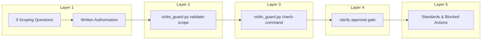

<p align="center">
  
</p>

<h1 align="center">Violin ☤ — Supervised Agentic Hermes Pentest Profile</h1>

<p align="center">
  <a href="https://github.com/Strategic-Automation/violin"></a>
  <a href="https://github.com/Strategic-Automation/violin/blob/master/LICENSE"></a>
  <a href="https://hermes-agent.nousresearch.com/">= 0.18.0"></a>
  <a href="https://www.kali.org/"></a>
  <a href="https://www.parrotsec.org/"></a>
</p>

<p align="center">
  <b>31 playbooks · 17 references · 12 templates · required execution guard · Hermes-native</b>
</p>

Violin is a **Hermes-native agentic pentest profile** for supervised, authorised penetration tests — from reconnaissance through safe exploit validation to reporting. It uses Hermes' built-in toolsets, three routed skills, and the required `violin-guard` plugin at the target-execution boundary. The standalone CLI supports release checks, diagnostics, and administrative recovery; target commands run through the plugin. Violin adds no profile-specific credentials and inherits the provider and tool backends already configured in Hermes.

```
hermes profile install https://github.com/Strategic-Automation/violin
hermes -p violin
```

---

## Features

<table>
<tr><td width="280"><b>🔬 31 Methodology Playbooks</b></td><td>7 operational playbooks (five execution phases, optional post-exploitation, and the tools catalog) + 24 vulnerability-class playbooks, routed across the `pentest`, `web-attacks`, and `access-control` skills.</td></tr>
<tr><td><b>🛡️ Multi-Layer Safety</b></td><td>Interactive scoping (9 questions) → scope validation → guard check → approval gates — every target-touching command validated before execution.</td></tr>
<tr><td><b>🧠 Pentesting Task Tree</b></td><td>Structured artifact tracking every task via `[x]/[ ]/[~]` markers across phases, with executor-owned history, hypothesis linking, and guard-bound batch reviews.</td></tr>
<tr><td><b>🌐 Browser + Web Research</b></td><td>Browser toolset for approved in-scope website enumeration; v3.0.0 gates the engagement workflow but does not provide a network-level browser allowlist. Web toolset for CVE lookup, exploit search, and OSINT.</td></tr>
<tr><td><b>📋 Evidence-Driven Reporting</b></td><td>Reproducible evidence with screenshots, tool output, and request/response pairs. CVSS 3.1 + 4.0 crosswalks and optional remediation patches.</td></tr>
<tr><td><b>🔗 Hermes-Native</b></td><td>Inherits your existing Hermes provider, model, and tool backends. Violin introduces no separate credential store or broker.</td></tr>
</table>

---

## Quick Start

```bash
# 1. Install the profile
hermes profile install https://github.com/Strategic-Automation/violin

# 2. Start a session
hermes -p violin

# 3. Let Violin ask scoping questions, then run your test
> Run a pentest against example.com
```

<details>
<summary><b>Prerequisites</b></summary>

- **Hermes Agent >= 0.18.0** — installed and on your PATH
- **Hermes provider configured** — Violin inherits your normal Hermes provider/model
- **Kali Linux or Parrot OS** — the primary execution environments; Docker Kali is the supported fallback when the host lacks pentest tools
- **Optional web/browser backend** — required only for Hermes web or browser capabilities; Violin does not add separate API credentials

</details>

<details>
<summary><b>Set as default profile</b></summary>

```bash
hermes profile use violin
```

</details>

---

## Engagement Workflow

```mermaid
flowchart LR
    A["1. Scoping"] --> B["2. Recon"]
    B --> C["3. Vuln Research"]
    C --> D["4. Exploitation"]
    D --> E["5. Reporting"]
    E --> F["6. Retrospective"]
    
    A -.->|"clarify"| G("Approval Gate")
    B -.->|"guard check"| G
    C -.->|"guard check"| G
    D -.->|"clarify + guard"| G

    style A fill:#1a1a2e,stroke:#e94560,stroke-width:2px
    style B fill:#16213e,stroke:#0f3460,stroke-width:2px
    style C fill:#1a1a2e,stroke:#e94560,stroke-width:2px
    style D fill:#16213e,stroke:#0f3460,stroke-width:2px
    style E fill:#1a1a2e,stroke:#e94560,stroke-width:2px
    style F fill:#16213e,stroke:#0f3460,stroke-width:2px
    style G fill:#2d2d2d,stroke:#ffd700,stroke-width:2px
```



| Phase | Action | Safety Gate |
|-------|--------|-------------|
| **1. Scoping** | 9 questions via `clarify` | User approval |
| **2. Reconnaissance** | Passive OSINT → tech detection → active scanning | Guard + approval |
| **3. Vuln Research** | CVE lookup, exploit search, attack surface analysis | Guard check |
| **4. Exploitation** | Safe PoC validation per vulnerability class | Guard + user approval |
| **5. Reporting** | Evidence compilation, CVSS scoring, remediation | — |
| **6. Retrospective** | Gap analysis, playbook coverage update | Mandatory |

---

## Architecture

```mermaid
graph TB
    subgraph "Your Machine"
        HE["Hermes Agent"]
        VI["Violin Profile"]
        GUARD["violin_guard execution + evidence"]
    end
    
    subgraph "Violin Skills"
        SK["pentest orchestrator"]
        WEB["web-attacks skill"]
        AC["access-control skill"]
        PB["31 Playbooks"]
        REF["17 References"]
        TEMP["12 Templates"]
    end
    
    subgraph "Configured Toolsets"
        T["terminal"]
        W["web"]
        B["browser"]
        F["file"]
        CE["code_execution"]
        S["skills"]
        CL["clarify"]
        D["delegation"]
        V["vision"]
        TD["todo"]
        VG["violin_guard"]
    end
    
    LLM["Your LLM Provider"]
    
    HE -->|"hermes -p violin"| VI
    VI -->|"loads"| SK
    VI -->|"requires"| GUARD
    SK -->|"routes to"| WEB & AC & PB
    WEB --> PB
    AC --> PB
    SK --> REF & TEMP
    HE -->|"calls"| T & W & B & F & CE & S & CL & D & V & TD & VG
    HE -->|"inherits"| LLM

    style HE fill:#2d2d2d,stroke:#ffd700,stroke-width:2px
    style VI fill:#1a1a2e,stroke:#e94560,stroke-width:2px
    style GUARD fill:#16213e,stroke:#0f3460,stroke-width:2px
```



### Enabled Toolsets

11 toolsets configured in `config.yaml` (`platform_toolsets.cli`): 10 built-in — `terminal`, `web`, `browser`, `file`, `code_execution`, `skills`, `todo`, `clarify`, `delegation`, `vision` — plus the `violin_guard` guard-plugin toolset.

### Conversation & Memory Isolation

- `memory.memory_enabled: false` — no global memory recall/write
- `memory.user_profile_enabled: false` — no global user profile access
- Engagement continuity lives in project files (scope docs, evidence, reports)
- Keep one Hermes conversation per engagement; after compression, resume in that conversation from `$ENG_DIR/state/`

---

## Safety Model



- **Authorised testing only** — no probing before scoping is complete
- **Approval gates** — scope, active recon, and exploitation each require explicit user approval
- **Guard check** — every target-touching command validated through `violin_exec` or another typed guard tool. `violin_exec` has no binary allowlist, so any installed non-interactive Kali/Parrot CLI tool can target the explicit in-scope host while the same scope, phase, PTT, hypothesis, history, evidence, timeout, and sync gates remain active. Violin's `pre_tool_call` plugin hook generically blocks target literals in raw `terminal` commands instead of maintaining a partial tool-name list. The CLI exposes the same check for diagnostics (exit 0=allowed, 1=blocked, 2=review)
- **Non-destructive by default** — exploitation limited to safe, reproducible PoC
- **Evidence-first** — every finding backed by reproducible tool output, screenshots, request/response pairs
- **Exploit-first validation** — no hypothesis advances to Validated without a verification command
- **Stateful recovery** — phase summaries and checkpoints restore the current engagement after context compression without starting a new conversation
- **Self-explaining guard** — `violin_status` (or `python scripts/violin_guard.py status --eng-dir "$ENG_DIR"`) shows the active task and phase, pending commands and their required phases, phase requirements, skill state, blockers, and exact next actions without running a command
- **Phase-aware work windows** — RECON/VULN_RESEARCH allow 10 guarded commands per reviewed batch; EXPLOITATION/POST_EXPLOITATION/PRIVESC/FLAGS allow 20, and the Hermes profile budget is 700 tool iterations
- **One-call reconciliation** — `violin_review_batch` validates the completed batch, optionally writes its receipt-backed finding, updates the active PTT row once, and clears the batch lock last

Full safety policy: `skills/pentest/references/standards.md`. Forbidden actions: `.hermes.md` §Forbidden Behaviour.

---

## Benchmarks & Evaluation

Violin is evaluated against the **Escape Duck Store** benchmark — a modern-stack (FastAPI + React) target with **20 real-world vulnerabilities** spanning business logic, authorization, injection, and SSRF.

> **Current measured results (deepseek/deepseek-v4-flash-0731):** best single run **17/20**, stable band **14–17/20** across repeated runs. Scoring is run-to-run model-variance dependent; a reliable **18/20+ has not yet been achieved.**

### Duck Store ranking (sourced)

| Rank | Tool | Recall | Model | Source |
| :---: | :--- | :---: | :--- | :--- |
| 1 | **Violin** | **17/20** (14–17 stable) | `deepseek-v4-flash-0731` | live runs |
| 2 | Escape Cascade | 15/20 | proprietary | [escape.tech](https://escape.tech/blog/benchmarking-agentic-ai-pentesting-tools/) |
| 3 | Claude Opus 4.8 (direct) | 14/20 | Claude Opus 4.8 | [escape.tech](https://escape.tech/blog/modern-ai-powered-pentesting-tools-in-depth-benchmark/) |
| 4 | PentAGI | 9/20 | DeepSeek v3.2 | [escape.tech](https://escape.tech/blog/ai-pentesting-agents/) |
| 5 | Shannon | 6/20 | DeepSeek v3.2 | [escape.tech](https://escape.tech/blog/ai-pentesting-agents/) |
| 6 | Strix | 1/20 | DeepSeek v3.2 | [escape.tech](https://escape.tech/blog/ai-pentesting-agents/) |

Competitor figures are Escape-reported (their agent, their validation); Violin's is self-reported. See [**docs/BENCHMARKS.md**](docs/BENCHMARKS.md) for the full methodology and caveats.

### Tested Models

| Model | Status | Result |
| :--- | :---: | :--- |
| **DeepSeek V4 Flash** (`deepseek-v4-flash-0731` / Pro) | **Tested** | Primary evaluation model; 14–17/20 (best 17/20) |
| **Qwen 3.8 27B** | **In evaluation** | Drives the guard surface and reaches exploitation, but a scored pass has not yet completed |
| **Qwen 3.5 9B** | Not viable | Empty-response generation instability mid-run |
| **Gemma 4 26B A4B** | Not viable | Fails scope bootstrap before target execution |
| **Nemotron 550B / Solar Pro 4** | Not viable | Protocol-incomprehension / hallucination |

*Violin inherits whatever model is configured in your Hermes agent (`hermes config`). Only `deepseek-v4-flash` has produced a reliable scored pass.*

### Running Benchmarks

```bash
# Run automated benchmark against target
uv run python -m benchmark.run --target https://duck-store.escape.tech

# Verify scorer calibration (known-good baseline)
uv run python benchmark/score.py --calibrate known-good
```

---

## Repository Layout

```
violin/
├── .hermes.md              # Project-level agent context
├── SOUL.md                 # Agent identity — senior pentester persona
├── config.yaml             # Profile config (toolsets, safety, memory)
├── distribution.yaml       # Hermes distribution manifest
├── benchmark/              # Automated Hermes evaluation and benchmark framework
│   ├── indexer.py          # Unified engagement artifact indexer with 2MB bounds
│   ├── run.py              # Automated profile benchmark runner & OpenRouter integration
│   ├── score.py            # Evidence-gated benchmark scorer & calibration
│   └── ai_judge.py         # Technical proof quality evaluator & bug auditor
├── plugins/violin_guard/   # Required Hermes guard plugin and execution boundary
│   ├── bash_ast.py         # bashlex AST command tokenization and parsing
│   ├── terminal_policy.py  # AST-based best-effort blocks for target-touching raw terminal calls
│   ├── targets.py          # Scope enforcement using netaddr and yarl URL parsing
│   ├── schemas.py          # Pydantic v2 tool schemas and validation
│   └── code_execution_audit.py # Engagement audit contract for execute_code
├── scripts/                # CLI and release smoke helpers
│   ├── violin_guard.py     # Diagnostic/admin CLI over the plugin modules
│   ├── smoke-test.sh       # Linux/macOS release smoke
│   ├── smoke-test.ps1      # Windows supplemental smoke
│   └── kali.sh             # Docker Kali helper
└── skills/
    ├── pentest/            # Engagement orchestrator (23 playbooks, 17 refs, 12 templates)
    │   ├── SKILL.md
    │   ├── playbooks/      # 7 operational + 16 vulnerability-class playbooks
    │   ├── references/     # 17 reference files
    │   └── templates/      # 12 templates (reports, evidence, methodology, contracts, PTY controller)
    ├── web-attacks/        # Routed skill — 5 injection/web playbooks (SQLi, XSS, SSRF, cmdi, traversal)
    └── access-control/     # Routed skill — 3 auth/authorisation playbooks (auth-bypass, IDOR, JWT)
```

---

## Release Verification

```bash
python scripts/violin_guard.py check-release
```

Validates the plugin manifest and registered tools, isolated Hermes-style plugin import, stale skill references, Ruff, and the full pytest suite.

Hermes skills are loaded on demand and enforced by Violin receipts. Start with `pentest`, then use `violin_record_ptt` to select the route-required skill. The first call prepares its real `skill_view` content without mutating the PTT; repeat the same transition after that tool result returns to the model to bind it. `violin_status` reports the route, binding, context generation, recovery action, and any obsolete legacy marker. Target and browser activity are blocked only in the same model call as delivery or binding, then open automatically on the next tool-loop continuation.

### Bundled & Optional Skills

Violin bundles core operational playbooks out of the box, and supports optional external Hermes skills:

| Skill | Type | Description | Installation |
|-------|------|-------------|--------------|
| `pentest` | **Bundled** | Main engagement orchestrator & playbooks | *Included with Violin* |
| `web-attacks` | **Bundled** | SQLi, XSS, SSRF, command injection, path traversal | *Included with Violin* |
| `access-control` | **Bundled** | Auth-bypass, IDOR, JWT analysis | *Included with Violin* |
| `fp-check` | Optional | False positive verification & review gating | `hermes skills install trailofbits/skills/plugins/fp-check/skills/fp-check` |
| `domain-intel` | Optional | Domain & DNS intelligence gathering | `hermes skills install official/research/domain-intel` |
| `osint-investigation` | Optional | Public records & OSINT investigation | `hermes skills install official/research/osint-investigation` |
| `sherlock` | Optional | Account & identity enumeration | `hermes skills install official/security/sherlock` |
| `oss-forensics` | Optional | Supply-chain & repository forensics | `hermes skills install official/security/oss-forensics` |
| `audit-context-building` | Optional | Codebase audit context building | `hermes skills install trailofbits/skills/plugins/audit-context-building/skills/audit-context-building` |
| `semgrep` | Optional | Static code analysis | `hermes skills install trailofbits/skills/plugins/static-analysis/skills/semgrep` |
| `codeql` | Optional | CodeQL semantic code analysis | `hermes skills install trailofbits/skills/plugins/static-analysis/skills/codeql` |
| `sarif-parsing` | Optional | SARIF report parsing & review | `hermes skills install trailofbits/skills/plugins/static-analysis/skills/sarif-parsing` |

---

## Optional: Kali Docker Container

<details>
<summary><b>One-time setup for a full Kali toolchain on any OS</b></summary>

See [`Dockerfile`](Dockerfile) for the unified container build (includes `nmap`, `gobuster`, `sqlmap`, `nikto`, `hydra`, `ffuf`, `whatweb`, `nuclei`, `httpx-toolkit`, `dnsutils`/`dig`, `jq`, `dnsx`, `subfinder`, `tirith`, and `duckduckgo-search`).

```bash
# Build the unified Hermes + Violin container image
docker build -t violin-hermes:latest .

# Run benchmark inside container with mounted host engagements directory
# (Automatically generates timestamped results in engagements/benchmark-run-YYYYMMDD_HHMMSS)
docker run -it --rm \
  -e OPENROUTER_API_KEY="$OPENROUTER_API_KEY" \
  -v $(pwd)/engagements:/violin/engagements \
  violin-hermes:latest \
  uv run python -m benchmark.run --target https://duck-store.escape.tech
```

See [`scripts/kali.sh`](scripts/kali.sh) for the host container exec helper.

</details>


## Contributing

See [CONTRIBUTING.md](CONTRIBUTING.md) for development setup, PR process, and code style.

## Security

See [SECURITY.md](SECURITY.md) for reporting vulnerabilities.

---

## License

MIT — see [LICENSE](LICENSE).
